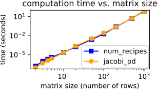

[](https://circleci.com/gh/jewettaij/jacobi_pd)
[](https://codecov.io/gh/jewettaij/jacobi_pd)
[](https://isocpp.org/std/the-standard)
[]()
[](https://creativecommons.org/publicdomain/zero/1.0/)


jacobi_pd
===========

## Description

This repository contains a small C++
[header file](include/jacobi_pd.hpp)
that implements the
[Jacobi eigenvalue algorithm](https://en.wikipedia.org/wiki/Jacobi_eigenvalue_algorithm).
It is [free of copyright](https://creativecommons.org/publicdomain/zero/1.0/).

The Jacobi algorithm remains one of the oldest and most popular methods for
diagonalizing dense, square, real, symmetric matrices.

The matrices passed to to the "Diagonalize()" function
can be any C or C++ object which supports \[i\]\[j\] indexing,
including X\*\* (pointer-to-pointer),
vector\<vector\<X\>\>&, or fixed-size arrays.
(Here **X** is any real numeric type.  Complex numbers are not supported.)

*(Memory allocation on the heap is avoided except during instantiation.)*


#### The main feature of this repository is it's [license](LICENSE.md).

As of late 2020, no simple public domain C++11 code
yet exists for matrix diagonalization.
Other C++ libraries such as Eigen or GSL are typically
much larger and use more restrictive licenses.
*(On several occasions, this has prevented me from including
their code in other open-source projects with incompatible licenses.)*
Some repositories may unwittingly contain code
snippets from other sources, such as
[numerical recipes](http://mingus.as.arizona.edu/~bjw/software/boycottnr.html).
This short repository was written from scratch.
No lines of code were borrowed or adapted from other sources.


*Caveats:* The code in this repository does not run in parallel,
and only works on dense square real symmetric matrices.
However it is reasonably
[short, simple](include/jacobi_pd.hpp), 
[fast](benchmarks/README.md) and
[reliable](.travis.yml).
You can do anything you like with this code.


##  Example usage

```cpp
#include "jacobi_pd.hpp"
using namespace jacobi_pd;

// ...
int n = 3;       // Matrix size
double **M;      // A symmetric n x n matrix you want to diagonalize
double *evals;   // Store the eigenvalues here.
double **evecs;  // Store the eigenvectors here.
// Allocate space for M, evals, and evecs (omitted)...
M[0][0] = 2.0; M[0][1] = 1.0; M[0][2] = 1.0;
M[1][0] = 1.0; M[1][1] = 2.0; M[1][2] =-1.0;  //Note: The matrix
M[2][0] = 1.0; M[2][1] =-1.0; M[2][2] = 2.0;  //must be symmetric.

// Now create an instance of Jacobi ("eigen_calc").

Jacobi<double, double*, double**> eigen_calc(n);

// Note:
// If the matrix you plan to diagonalize (M) is read-only, use this instead:
//   Jacobi<double, double*, double**, double const*const*> eigen_calc(n);
// If you prefer using C++ vectors over C-style pointers, this works also:
//   Jacobi<double, vector<double>&, vector<vector<double>>&,
//          const vector<vector<double>>&>  eigen_calc(n);

// Now, calculate the eigenvalues and eigenvectors of M

eigen_calc.Diagonalize(M, evals, evecs);  //(successful if return value is > 0)

// If you have many matrices to diagonalize, you can re-use "eigen_calc". (This
// is more efficient than creating a new "Jacobi" class instance for each use.)

std::cout << "eigenvalues:  ";
for (int i=0; i < n; i++)
  cout << evals[i] << " ";
cout << endl;
for (int i=0; i < n; i++) {
  cout << "eigenvector" <<i+1<< ": ";
  for (int j=0; j < n; j++)
    cout << evecs[i][j] << " ";
  cout << endl;
}
```

## Benchmarks

[](benchmarks/README.md)

[***(details here...)***](benchmarks/README.md)


## Installation

Copy the file(s) in the [include](include) subdirectory,
to a location in your
[include path](https://www.rapidtables.com/code/linux/gcc/gcc-i.html).
No linking is necessary.
This is a header-only library.


## Development Status: *stable*

**jacobi_pd** has been
[tested](.travis.yml)
for accuracy and memory safety
over a wide range of array types, matrix sizes,
eigenvalue magnitudes and degeneracies.
**jacobi_pd** code is currently used in the popular 
[LAMMPS](https://github.com/lammps/lammps/pull/2347)
and
[colvars](https://github.com/Colvars/colvars/pull/360)
MD simulation tools.


## Requirements

A C++11 compatible compiler.


## License

*jacobi_pd* is available under the terms of the [Creative-Commons-Zero license](LICENSE.md).

*Please send me corrections or suggestions.*

